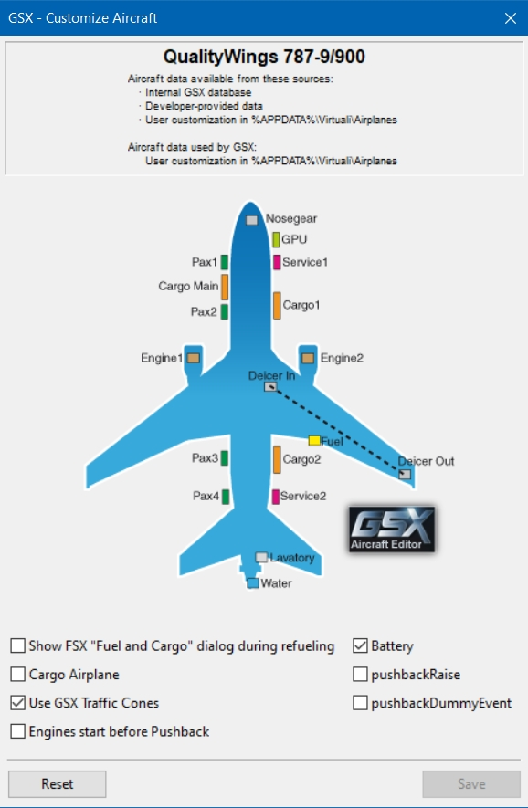
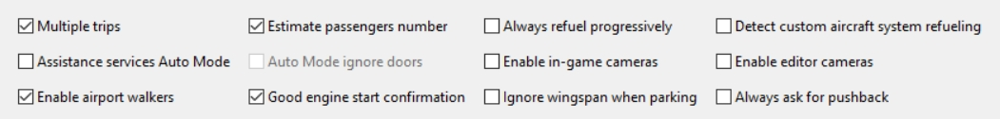

# QualityWings2GSX: SimBrief and GSX Integration for the QualityWings 787
## Description
If this Toolset is of interest to you, can be answered easily by yourself:
- Wished that you could just get the planned Fuel and Weights from your SimBrief OFP automatically by calling the GSX Services? Without any Payload Dialog or Dispatch Page / Dispatcher involved?
- Wished that the Plane was actually & progressively refueled and (De-)Boarded when GSX is active? (Not refueling and boarding an already loaded Plane - really seeing the GW rise and fall as the Passengers are entering/leaving Plane and the Containers are loaded/unloaded)
- Wished that the Ground- and Cabin-Crew would just take care of the Doors, instead you "leaving" the Cockpit to open/close all that Doors?
- Wished the Jetway/GPU would just automatically be called / removed, the Chocks being set / removed and External Power connected / disconnected?<br/>

So if the Answer is 'yes' to any of these Questions: Here is a tool you might want to try out :wink:<br/>But before getting to excited, here the caveat: you need a registered Version of FSUIPC to use the whole Toolset!<br/><br/>

Since you're still interested, here the Features of the individual Tools/Scripts contained in this Toolset:
- An external Program (*QualityWings2GSX*) which will read your current SimBrief OFP and uses the Fuel Weights, Passenger and Bag Count (and their configured Weight in SimBrief) to progressively Refuel, Board and Deboard the Plane. It will set these Values in / use the Values with GSX so that the Refuel, Board and Deboard Animation is "in synch" with your OFP Data.<br/>It does not matter if your OFP is in kgs or lbs, if your APU is running, the Refueling needs multiple Trips. It is also "turn-around-capable": After being deboarded the new OFP will be loaded and used for the next Refuel, Board and Deboard Cycle. It uses FSUIPC (C# Client) to communicate with the Sim/GSX/Plane.
- A small "GSX Lua Library" (*GSX_AUTO*) which can also be used for other Planes - it does the GSX Menu Handling and some Automation. The Functions can be called with "LuaToggles" via FSUIPC. Or from your StreamDeck - when used together with PilotsDeck you can display the current (De-)Boarding and Cargo (Un-)Loading Progress and what is the current State / Service that can be called.
- A Lua Script to automate the Ground-Service Handling (*QW787_SYNC*) for the QualityWings 787. It opens / closes the respective Doors as requested from GSX, automatically after Boarding is completed or when the Cargo (Un-)Loading is finished. It will set / remove the Chocks & External Power and will move the Jetway/GPU automatically for you.<br/><br/>

## Releases
There are two Releases:
- If you want the whole GSX and SimBrief Integration/Automation but don't have a StreamDeck / don't use PilotsDeck: Download [QualityWings2GSX.zip](QualityWings2GSX.zip)
- If you're also using PilotsDeck and/or the published Profiles, you find can everything in one Package ready to be used together. Download [QualityWings2GSX-PilotsDeck.zip](QualityWings2GSX-PilotsDeck.zip)
<br/>

# Quick-Start
Quick-Start Steps for advanced Users (detailed Explanation below):
- Binary anywhere you want, Scripts to FSUIPC6 Folder.
- Add the Binary under [Program] and the Scripts as [Auto] Scripts (Global or Profile-specific) to your FSUIPC6.ini
- Modify the Tank Capacities in the aircraft.cfg Files to 5737 / 5737 / 23278<br/>
**OR** Modify the Tools .config File to the Capacities from your aircraft.cfg Files
- Enter your SimBrief Pilots ID in the .config File
- Configure GSX to not show the Refuel-Dialog in the Aircraft Configuration
- Configure the Plane in SimBrief to use lbs: 190 lbs/Passenger, 55 lbs/Bag, 232809 lbs as Max Fuel Capacity (or whatever you use and fits to your aircraft.cfg)
- Dispatch your OFP as you normally would, either in kgs or lbs - whatever you prefer. Make sure to use the default ICAO Code/Aircraft Name.
- Call the GSX Services on whichever Way you want - everything is taken care of now. Be sure to enable your Battery before calling anything!

<br/>

# Installation
## QualityWings2GSX
You can basically place it anywhere you want - preferrably with your other Addons / Sim Files. Your AV-Scanner might being triggered, so place it in a Location where it is excluded. Sometimes, even when excluded by your AV, Windows-Security might cause Problem: try to Unblock-File it via Powershell.<br/>
The Tool is intended to being started when the Sim is running and the QualityWings 787 is loaded - otherwise it will just exit. You can, of course, start it manually or let it start automatically via FSUIPC. Add this to your FSUIPC6.ini for an automatic Start:
```
[Programs]
RunIf1=READY,KILL,X:\Path\to\the\Installation-Folder\QualityWings2GSX.exe
```
It will then be automatically started (and stopped) by FSUIPC when FSUIPC/the Sim is ready for Requests/Processing. With that Mechanic it will be loaded for every Plane, but don't worry: it closes immediately when the loaded Plane isn't a QW787.
## GSX_AUTO + QW787_SYNC
- Place the Files from the FSUIPC6 Folder in your FSUIPC6 Addon-Folder (the Folder where your FSUIPC6.ini is located)
- Either start the Scripts (Auto + Sync) manually ...
- ... or add them as Auto-Scripts to your FSUIPC6.ini. Start P3D/FSUIPC6 once so the Files are added (if you're not familiar with adding them manually). Then add the following to your FSUIPC6.ini:<br/>
```
[Auto.QW787]
1=Lua GSX_AUTO
2=Lua QW787_SYNC
```
Assuming your FSUIPC Profile is named "QW787"! Replace that with the correct Name. If already using Auto-Scripts, change the Numbers accordingly (these Scripts don't need to be run first - but these two in this Order!).<br/>
If you don't have a FSUIPC Profile for the QW787, start them as "Global"/"Default" Auto-Scripts:
```
[Auto]
1=Lua GSX_AUTO
2=Lua QW787_SYNC
```
If you plan to use the GSX_AUTO Script with other Planes, it has to be started as "Global"/"Default" Auto-Script!<br/>
If you're using the PilotsDeck Profile I have published: add the QW787_AUTO as second Script (GSX_AUTO -> QW787_AUTO -> QW787_SYNC)<br/><br/>
## Complete Release with PilotsDeck Profiles
- Follow the Readme for the QW787 Profiles in the [PilotsDeck Repository](https://github.com/Fragtality/PilotsDeck/tree/master/Integrations/QualityWings%20787%20(P3D))!
- The Script Files in the Complete Release are configured accordingly to be used together with QualityWings2GSX and the PilotsDeck Profiles. The Basic Configurations is already done.
<br/>

# Configuration
## QualityWings2GSX / SimBrief / GSX
### QualityWings2GSX
The most important Settings you have to set are your SimBrief's **Pilot ID** (look it up [here](https://www.simbrief.com/system/profile.php#settings)) and the **Maximums** for the Fuel-Tanks.<br/>
If you're not aware: there is a Discrepancy with the QW787 showing different Maximums for the Fuel-Quantity (or specifically Quantity-to-Weight-Ratios). The EFB and Dispatcher will report a higher Capacity than actually configured in the aircraft.cfg. This is not an Issue when using the EFB - 100% there will give you 100%. But when other Programs (GSX, my Tool) set the Tanks to 100% the EFB will report ~97% and EICAS a lower than expected Fuel-Weight. So you have two Options:
- (Recommended) Modify the aircraft.cfg (all three Variants) to use the Maximum Values configured in the Tool (so it everything is "aligned" to the same Maximums). It is *5737* gallons for the Wings and *23278* for the Center. The Maximum fuel Capacity to be used in SimBrief is *232809* lbs then.
- If you don't want to modify the aircraft.cfg, you'll need to modify the .config File of the Tool to use whatever you have in your aircraft.cfg. By Default it is *5570* gallons for the Wings and *22470* for the Center.

I have added my aircraft.cfg (for the Dash9) as an Example/Reference. Don't use it to replace your aircraft.cfg - I've modified the Cameras/Views to my Preferences!
<br/>

The Tool is configured through the QualityWings2GSX.config File. Make sure you keep the XML-Syntax intact or else the Tool won't start!
- **pilotID**: Set this to your SimBrief Pilots ID!
- **constMaxWing**: Set this to the Value from your aircraft.cfg!
- **constMaxCenter**: Set this to the Value from your aircraft.cfg!
- *simbriefURL*: SimBrief's URL to fetch the current OFP in XML-Format. Is already set, needs only to be changed if SimBrief should change the URL.
- *fmsPath*: If you want the RTE File for that OFP directly downloaded to your FMS, set the Full Path here (typically Prepar3D-Folder\QualityWings\QW787\FlightPlans). If you don't want/need the RTE File or use SimBrief Downloader for that - just leave it empty!
- *xmlFile*: The File to be used as "Offline" Flightplan (see FAQ).
- *useActualValue*: The SimBrief OFP has planned and actual Passenger/Bag Counts. The Tool is set to use the actual Value, so there is sometimes Variation. If you always want the planned Number, set it to false.
- *noCrewBoarding*: The Tool will disable GSX' Simulation to (De)Board the Pilots and Crew by default. If you want that to happen, set it to false.
- *constGPS*: The Gallons-Per-Second used by the Plugin to do the Refueling. By default it is 16.5 gal/s which is 990 gal/min (the fastest Truck/Pump from GSX is 1000 gal/min, the slowest 800 gal/min - for Reference). Or in "metric-speak": it is ~50kg/s which gives you 0.1t every 2 Seconds :wink:<br/>
Note that this is the *total* flow, it will be split across the Tanks (depending on how many need to be filled)! The Wings will be primarly filled, everything above their Capacity goes to Center. So if you do a "Short-Haul" only 2 Tanks will be filled in parallel (Wings), for a "Long-Haul" all 3 Tanks will be filled in parallel and when the Wings are full, the Center will be filled with the full flow.<br/>
Also note that this Value scales with (P3D's) Time Acceleration, so when using 2x Acceleration the Refueling will be twice as fast. The GSX Time Acceleration has no Effect on the Tools' Refuel Process.
- *constPaxDashX*: The Number Seats in Business;Economy for the given Variant. Already set to QW's Defaults.
- all other const Variables don't need and should not be touched - they are really constant Constants 😜

### SimBrief
Configure the Plane in SimBrief with **lbs** - even when you use only OFP's in kgs! The Passenger-Weight to be used is *190*lbs and Bag-Weight is *55*lbs. Whichever option you choose for the Fuel-Capacity: use the Total Capacity in gallons from your aircraft.cfg, multiply it with *6.69921875* and use the Result as the Max Fuel Capacity in SimBrief.<br/>
Make sure you use default ICAO Code and Aircraft Name (B789 / B787-9 for Example). The Tools checks if the current OFP matches your Type/Variant loaded.<br/>

### GSX
Make sure you're Installation is updated and uses the Version released from January 31st 2022! FSDT has added Support for the QW787's Chocks, you can now release the Parking Brake and GSX will continue with its Service.<br/>
You have to change the GSX-Configuration for the Plane, it has now a "Custom Fuel System" - the Fuel-Dialog has to be disabled (for every Variant)! GSX will not refuel the Plane directly anymore, that is done by the Tool now.<br/><br/>
Here what the Aircraft-Configuration should look like:<br/>
<br/><br/>
Here the Global-Configuration I use (as set per FSLabs Recommendation - nothing special for my Tool to set here, that I'm aware of):<br/>
<br/><br/>

## GSX_AUTO
This Script keeps track of the current Service State / Cycle and is used by QW787_SYNC to trigger GSX-Actions. It registers Flags to be used with LuaToggle Events so the Functions can be called by Joystick (or StreamDeck).<br/>
The most interesting are: "GSX_AUTO_CONNECT" (Flag# 9) and "GSX_AUTO_SERVICE_CYCLE" (Flag# 10). The first one will connect or disconnect the Jetway/GPU (whichever is available) and the second one automatically calls the next Service (Refuel -> Cater -> Board -> Push -> Push confirm -> ... after Touchdown -> Deboard -> start over with Refuel).<br/>
The File in this Repository and the "GSX only" Release are configured for Usage without PilotsDeck, so *writeOffsets* is disabled.
- *delayOperator*: The Time in ms (default 7500 = 7.5s) the Tool will wait for you to select something in the Ground-Handler Dialog from GSX (before the next Action will be triggered). The Script expects this Dialog to be closed before it selects the Jetways/calls the GPU. The Delay will be applied when the Script is in the "Refuel" State and the Ground-Service is not "connected" (Jetway/GPU in Place) - this is typically at your first Leg when you start on the Parking Stand. So this Delay will not be applied when the Deboard Service is called - it is assumed you've already told GSX which Stand to use on your Taxi-In (and answered that Question then).
- *writeOffsets*: Only useful if you're using PilotsDeck (or anything else to Display Offsets). When enabled it will write the (De)Boarding and (Un)Loading Progress to the two Offsets below. The Service State (and therefore which Service can be called) will always be written to the numeric Lvar "GSX_AUTO_SERVICE_STATE".

## QW787_SYNC
This Script is an essential Part of the GSX Integration/Automation. It will handle the Doors, Chocks/Ext Power and operates the Jetway or GPU.
The File in this Repository and the "GSX only" Release are configured for Usage without PilotsDeck, so *syncPilotsDeck* is disabled. *syncGSX* and the other GSX Options are enabled of course 😆 All other Options are disabled, set them to your liking.
- *syncPilotsDeck*: Only interesting if you use PilotsDeck and/or the Profiles I've published (MCP Display + Buttons, Baro). Make sure the preconfigured Offsets are not in use!
- *syncCabin*: Turn the Cabin Lights on/off with the Overhead Cab/Util Button
- *syncBrake*: If you have have a Joystick/Input Device like the TCA, the Parking Brake will be synced to that Buttons State. Configure both brake-Variables accordingly.
- *syncFD*: Set the FO's FD Switch to the State of the Captain's Switch
- *syncGSX*: The essential Setting to enable the whole Integration/Automation. Only usable with the GSX_AUTO Script running!
- *syncChocksAndPower*: Set or Remove External Power available and Chocks when Jetway/GPU is connected or removed. *syncGSX* has to be true for that. Can be temporarily overidden with Tow Power set to ON (it will not touch the Variables as long this Button is on).
- *operateJetways*: Automatically remove Jetway/GPU before Push-Back or call Jetway/GPU and Deboard when Arrived. You can disable that if you want to handle that manually.
  - For Removal the Trigger is: GSX_AUTO is in Push-State *AND* Beacon is ON *AND* Jetway/GPU in Place *AND* Parking Brake is SET *AND* FwdExt Pwr is OFF.<br/>
  - For Call the Trigger is: GSX_AUTO is in Deboard-State *AND* Jetway/GPU not in Place *AND* Engines are STOPPED *AND* Beacon is OFF
  - YES, it will disconnect even if your APU is not Running - it does not automate your Job 😜
<br/>

# FAQ
**Do I really need all of these Files?**<br/>
Excluding the PilotsDeck Profiles: *YES*, if you want the whole GSX / SimBrief Automation & Integration Functionality!<br/>
If you just want the SimBrief / GSX Integration: *NO*, you just need the Binary! You can call and handle all Ground-Services like before but now with them loading the Weights from your OFP.<br/>
If you just want the GSX Automation: *NO*, you just need the Scripts! You have to (un)load the Plane like before, but all the Doors, Chocks/ExtPwr and Jetway/GPU will be handled automatically.
<br/><br/>
**I don't have a registered Version of FSUIPC**<br/>
That's a little bit "suboptimal" when you're interested in automating Things within the Sim 😉<br/>
The Scripts will definitively not work. The Binary should work: one of the basic Purposes of FSUIPC is to allow external Applications to communicate with the Sim - so I guess/assume it will work!
<br/><br/>
**I dont use SimBrief, is that of any use to me?**<br/>
First off: try it! I was sceptical at first too - now I can't imagine not using it! 😁<br/> 
Like described in the first Question: you can use the Scripts without the Binary.<br/>
But: you can still use the Binary even without SimBrief - that is what the ofp.xml File is for! Basically it is a "extra-slim" Version of the SimBrief xml with the basic Values needed for the Binary to work. Change the Fuel Weight and Pax/Bag Count accordingly in the Units you prefer. Be sure to match the Variant to the one you are currently using and to change the Flight Number when doing a Turn-Around. Else the Plan will not be loaded!<br/>
If the File exists, it will always takes precedence over the SimBrief ("Online") OFP. Leave it renamed to .off if you want to use your Online OFP!
<br/><br/>
**What if I had a Sim-Crash and load the Plane In-Flight?**<br/>
Both the Binary and the Scripts will recognize that and start with their State-Tracking in "Flight". After you have arrived everything should work normally. Based on your current OFP when you reloaded the Flight - so don't dispatch a new Flight if you need to reload!
<br/><br/>
**The automatic Requests sometimes do not work!**<br/>
Be sure that the Sim has Input-Focus! GSX_AUTO sends a Keypress command through FSUIPC (for the GSX Menu Hotkey), so it requires Input-Focus to open the Menu (Navigating in the Menus is then down via Control-Codes).
<br/><br/>
**Will it get confused if I request the Services manually and/or out of order?**<br/>
The Binary and Scripts use the State Lvars provided by GSX and basic Offsets like "On Ground" - so it should not get confused (had not the Time to test every combination). You can call Refuel, Catering and Boarding in any order you wish regardless of being manually or through Script. Everything else is assumed to happen in Order: you don't Deboard without being arrived - you push & fly and arrive before Deboarding.
<br/><br/>
**The Scripts seem to call the GPU twice! / The Scripts tries to call a GPU on a Gate!**<br/>
GSX does not set the Jetway Variables early enough so that the Script could already know if a Jetway is available or if a GPU should be called. So it has to open the Menu shortly and go to the Additional Services Menu for these Variables to be set. The second Call is then the "real" Call.<br/>
Also it can indeed happen that the GPU is dismissed twice on Push-Back: the GSX Variables only show a Service being "moved" when it is actually moved. So Jetways will immediately reflect that they are moving, the GPU only when it hooked up again. So if you immediately call Push-Back (through GSX_AUTO_SERVICE_CYCLE / GSX_AUTO_PUSH) the Script sees that you're still "connected" and will dismiss the GPU again. But that should not break anything, the GPU will still be removed and Push-Back can begin after that!
<br/><br/>
**You're just writing "Jetway/GPU" - but what about the Stairs?**<br/>
No worries - they are operated by GSX itself! When (De)Boarding is requested, they will move automatically. The Script will open/close the Doors automatically to GSX's Requests.<br/>
The Stairs will be removed by GSX_AUTO as soon as Deboarding has finished - or else GSX will run into a "behavior" not sending the Fuel Truck. For that Reason, GSX_AUTO_CONNECT also will not call the Stairs when in Depature (Refuel State).
<br/><br/>
**How many Stairs or Jetways will be requested?**<br/>
The Number of Stairs depends if you have modified the GSX Aircraft Configuration! By default QW/FSDT will use L1, L2 and L4 for (De)Boarding - so it will be 3 Stairs! If you disabled L4 for e.g., it will be 2.<br/>
The Number of Jetways is 2 or 1. I did not find a way for the Script to know how many Jetways are available, so it will use the Key-Sequence: 6->1->2->3.
- If 2 Jetways are available, these 2 will always be connected (normally First to L1, Second to L2 - if your Jetways "cross" it is because the Scenery has an "uncommon" Order).
- If only 1 Jetway is available, only this one will be connected (normally to L1).
- Should there be 3 Jetways available, this Key-Sequence will not work! Choose another Gate and leave the 3 Jetway Gates to the A380's and Jumbos 😆 

<br/><br/>
**What if the Jetway has no Power Connection configured?**<br/>
The Script doesn't check that - all Jetways are assumed of having a Ground Power Connection! When a Jetway is connected, the External Power Available will be set!
<br/><br/>
**What if the Stand has no Underground Fuel? Does it support multiple Trips?**<br/>
No Problem, it works with both and supports multiple Trips! In either Case: the loaded Fuel is only increased as long the Fuel-Hose is connected (when slow-Joe finally manages to get it connected - he is sooo slooow! 😆)
<br/><br/>
**I've less Fuel in Tanks than before calling Refuel! / The Refuel does not stop!**<br/>
The Binary will indeed *decrease* the Fuel in all of your Tanks or the Center Tank, if you are above the planned Weight! It's very Purpose is to get you exactly what is in the SimBrief OFP.<br/>
If you should do that, there is a Chance of GSX never stopping with the Refuel Process! GSX monitors the Capacity increasing, so a Decrease won't trigger GSX' Logic to end the Refuel Process! It can be fixed when setting a higher Value manually in the Payload-Dialog. But: just don't use it to "pump-out" Fuel 😉
<br/><br/>
**So I can't use the APU while Refueling?**<br/>
That's not a Problem, you can have it running! The Fuel Capacity will still be increasing and will stop increasing when the Target is reached - GSX's Logic will be triggered and the Refuel Process stops.<br/>
The Binary itself uses the right Wing Tank as Reference for the Wings, it too will stop the Refueling even when the APU is decreasing the Quantity in the left Wing Tank!
<br/><br/>
**Do I need to set the Fuel Tanks to a specific Value before calling Refuel?**<br/>
Depends if you are using the QW787_AUTO Script (respectively the QW_INIT Function) from the PilotsDeck Integration. The Init-Function will set your Plane to 1.5% in the Wings and 0% in the Center when used. If not using it: make sure your Fuel is below your planned Weight before calling Refuel to avoid Problems (see above)!<br/>
Besides that, everything what is in the Tanks (and not above the Planned Weight) stays there. The Tanks are filled up like they would normally.
<br/><br/>
**The Binary is not running! / I can't see a Window! / How can I know what the Tool is doing?**<br/>
This is on Purpose, it is compiled to not open a Window and do its work "silently" in the Background!<br/>
If you really want to know what it is doing: have a look at the Log-File: QualityWings2GSX.log.<br/>
The Scripts log to the FSUIPC6.log what they are doing.
<br/><br/>
**What are these Service / Cycle States? How they a triggered?**<br/>

The GSX_AUTO Script has the following States (can be read via Lvar "GSX_AUTO_SERVICE_STATE"):
- 0/Refuel: The Refuel truck will be requested when GSX_AUTO_SERVICE_CYCLE is called. The State will change if the Truck is in Place OR the Boarding is started.
- 1/Cater: The Catering will be requested when GSX_AUTO_SERVICE_CYCLE is called. The State will change if the Trucks are in Place OR the Boarding is started.
- 2/Board: The Boarding will be started when GSX_AUTO_SERVICE_CYCLE is called. The State will change when GSX marks the Boarding as being completed.
- 3/Push: Either the Push-Back is requested or the Engine-Start is confirmed. The State will change when GSX marks the Push-Back as being completed.
- 4/Taxi-Out: The State while the Plane is still on the Ground.
- 5/Flight: The State will always be set when the Plane is not on the Ground.
- 6/Taxi-In: The State after the Plane is on the Ground again and Engines are still running (as recognized by GSX)
- 7/Deboard: The Deboarding will be requested when GSX_AUTO_SERVICE_CYCLE is called (if you don't let QW787_SYNC request it for you). The State is active as long the Deboarding is not marked as being completed. After that it will start over with 0/Refuel!


The Binary has the following States (internaly):
- 0/Pre-Flight: The State is only used once - on your first Leg when the Sim/Plane is loaded. When you enable the Batteries, the OFP will be loaded and it goes in the next State. If the Plane is not on the Ground, the OFP will be loaded and the State advances directly to Flight.
- 1/At Depature Gate: The State as long Refueling and Boarding are not finished (Catering does not matter). Advances to the next State as soon as these two Services are finished.
- 2/Taxi Out: The State as long as the Plane is still on Ground (Push-Back State does not matter).
- 3/Flight: The State as long the Plane is in the Air.
- 4/Taxi In: The State when the Plane has touched down and Engines are still running.
- 5/At Arrival Gate: The State while the Plane is being deboarded. Advances when Deboarding is finished.
- 6/Turn-Around: The Binary will sleep for the first 5 Minutes in this State. After that it checks every 60s for a new OFP (if not directly found). When a new OFP has been found, it starts over at 1/At Depature Gate. An OFP is considered "new" when the Flight ID (Callsign and/or FlightNumber) are different to the last used OFP.
<br/><br/>

**I have installed all that and now the QW start with all the Lights on!**<br/>
The QW787 is very vulnerable to "Loading Order Issues" it seems. For Reasons unknown, some Combination of QW and (GSX or FSUIPC Auto Scripts or RAAS Pro or whatever) can trigger the 787 being loaded with all Indication Lights on (the Switch is permanently in On/Test Position). The Plane is working normally, so let the Init-Script take care of that or move the Switch manually.<br/>
I've tried to avoid it as much as I can with the Scripts sleeping the first 30 Seconds before doing anything. You might try playing with the the FSUIPC Options "InitDelay" (30-45) and "InitialStallTime" (15-20), I could reduce this Effect with that sometimes. BUT: It still happens and somehow breakes the FSUIPC's Axis Processing for the Plane (e.g. to have the Reverser on the Throttle Axis) - so I don't use that personally and just live with this Effect.<br/>
Should I EVER find the real Root-Cause, I'll let you know and will fix or at least try to workaround that! So far FSDT and FS2Crew denied that GSX/RAAS could trigger something like that. QualityWings does not have answered yet.
<br/><br/>

**What if I need Help with that?**<br/>
Just contact me via PM in the AVSIM, FSDT or QW Forums!
<br/><br/>
